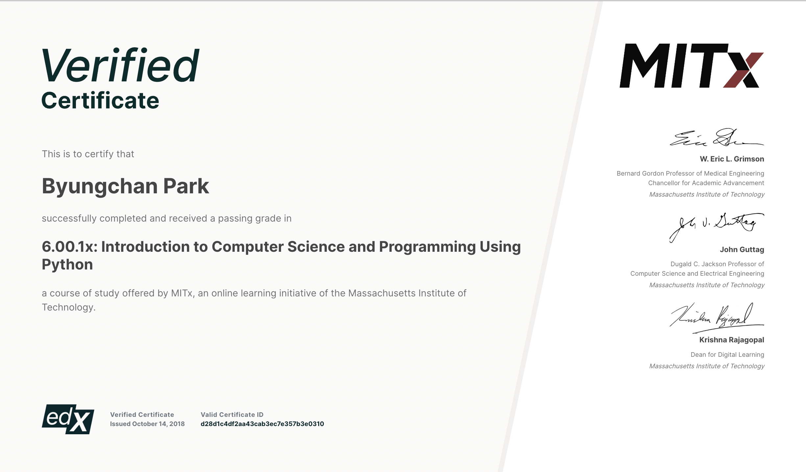
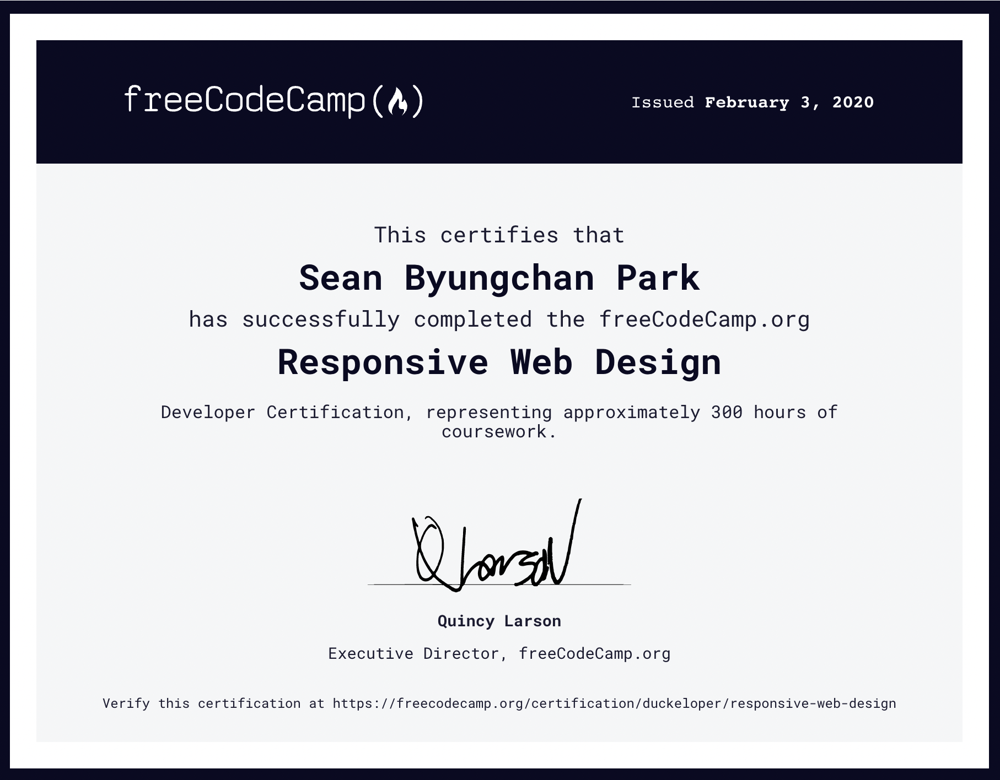
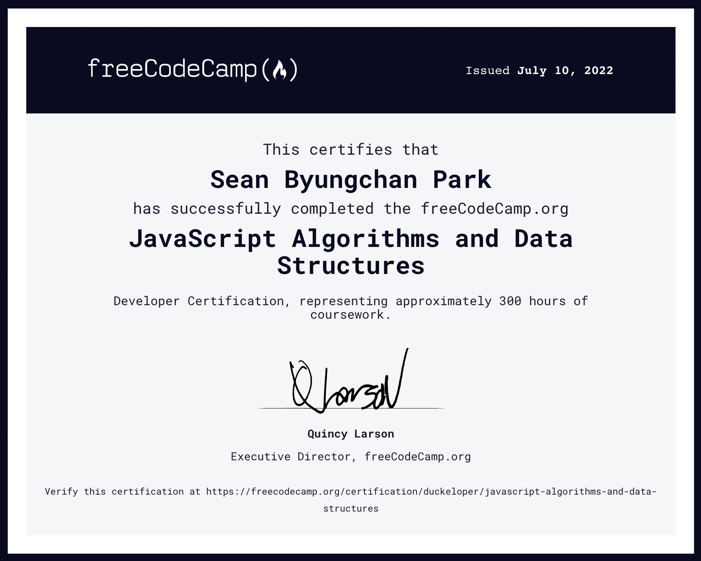
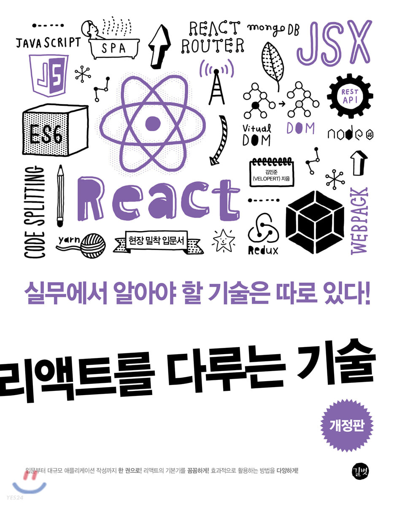

# 모던 자바스크립트 Deep Dive 학습노트

 

## 1. 리포지토리 소개

 

<figure align="center">

<figcaption>모던 자바스크립트 Deep Dive</figcatipn>
</figure>

 

본 리포지토리는 이웅모 님의 [모던 자바스크립트 Deep Dive](https://wikibook.co.kr/mjs/)를 교재로 학습한 기록입니다. examples 폴더는 책이 제공하는 예제를 그대로 담고 있으며, practice 폴더는 본문 발췌와 요약, 그리고 제가 직접 실습한 예제를 담고 있습니다.

 

---

 

## 2. 학습 배경

 

2022년 5월, 코딩 공부를 다시 시작했습니다.

 

"다시"라고 표현한 것은 코딩 공부가 완전히 처음은 아니었기 때문입니다. 저는 2020년에 [edX](https://www.edx.org/)에서 [Introduction to Computer Science and Programming Using Python](https://www.edx.org/course/introduction-to-computer-science-and-programming-7) 과정과 [freeCodeCamp](https://www.freecodecamp.org/)의 [Legacy Responsive Web Design](https://www.freecodecamp.org/learn/responsive-web-design/) 과정을 수료한 경험이 있었습니다.

 

<figure align="center">

<figcaption>edX 컴퓨터 과학과 프로그래밍 입문 수료증</figcaption>
</figure>

 

그러나 이전까지 배웠던 내용은 하나도 기억나지 않았습니다. 처음부터 다시 쌓아올려야 했습니다.

 

먼저 [생활코딩](https://opentutorials.org/course/1)의 HTML, CSS, 자바스크립트 강의로 시작했습니다. 개발자 이동욱 님이 [블로그](https://jojoldu.tistory.com/505)에서 강력히 추천하셨기 때문입니다.

 

> 현존하는 초보자를 위한 웹 개발 전체 과정을 훑는 강의 중 생활코딩의 웹 개발 과정 보다 좋은건 없습니다.
>
> 무료라서 그런게 아니라, 유료 강의까지 포함하여도 초보자의 마음을 가장 잘 이해하고 있는 강의는 생활코딩 강좌들입니다.
>
> _- 이동욱_

 

6월에는 freeCodeCamp의 개정된 [Responsive Web Design](https://www.freecodecamp.org/learn/2022/responsive-web-design/) 과정을 재수료했습니다.

 

<figure align="center">

<figcaption>FCC 반응형 웹 디자인 과정 수료증</figcaption>
</figure>

 

7월에는 freeCodeCamp의 [JavaScript Algorithms and Data Structures](https://www.freecodecamp.org/learn/javascript-algorithms-and-data-structures/) 과정을 수료했습니다. 2020년에는 이 단계에서 코딩 공부를 포기했었는데, 이번에는 무사히 끝마칠 수 있었습니다.

 

<figure align="center">

<figcaption>FCC 자바스크립트 과정 수료증</figcaption>
</figure>

 

그 후 React를 공부하려 했으나 잘 되지 않았습니다. freeCodeCamp에서는 VanillaJS로 알고리즘을 주로 다뤘을 뿐, 웹앱을 구현해보지는 않았습니다. 그런 상황에서 React를 배우려니 앞뒤가 뒤바뀐 느낌이 들었습니다.

 

어느 순간, [김민준(Velopert)](https://github.com/velopert) 님의 [리액트를 다루는 기술](http://www.yes24.com/Product/Goods/78233628)로 공부를 하고는 있는데 점점 아무것도 이해되지 않는다는 것을 느꼈습니다. 예제를 따라 코드를 입력하고 있을 뿐, 머릿속에 들어오는 것이 없었습니다.

 

<figure align="center">

<figcaption>리액트를 다루는 기술</figcaption>
</figure>

 

React를 할 때가 아니라는 생각이 들었습니다. VanillaJS를 먼저 공부해야겠다고 결심했습니다. 그리고 유튜브 [라매개발자](https://youtu.be/YbVuqWD12Ko) 님의 추천으로 이 책, "모던 자바스크립트 Deep Dive"를 만났습니다.

 

---

 
